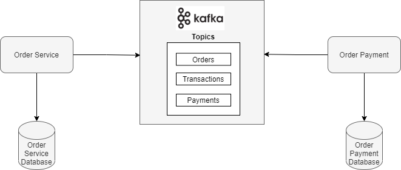

### Este exemplo foi implementado utilizando as seguinte tecnologias:
- Spring Cloud Stream e Apache Kafka Binder
- Reactive Spring
- Utilização de programação reativa para retornar o `Flux` a partir da API JDBC bloqueante.
- Banco de dados H2

### Arquitetura do Sistema - Saga Coreografado

<p>
    
</p>


#### Para execução do docker compose
O docker compose irá executar o Zookeeper e o Apache Kafka
```
cd docker
docker-compose up
```

#### Para execução do Microsserviço `Order`
```
cd docker
docker-compose up
```


#### Para execução do Microsserviço `Payment`
```
cd order-service
mvn spring-boot:run
```

#### Para acessar a console do banco de dados H2 do Microsserviço `Order`
```
http://localhost:8081/h2-console/
JDBC URL: jdbc:h2:mem:order
User Name: sa
Password: 
```

#### Para acessar a console do banco de dados H2 do Microsserviço `Payment`
```
http://localhost:8082/h2-console/
JDBC URL: jdbc:h2:mem:payment
User Name: sa
Password: 
```

### Tópicos
- Existem 3 tópicos que serão utilizados pelo microsserviço de Order e Payment
```
- orders
- payments
- transactions
```

#### Execução
1. Execute o microsserviço Order e Payment
2. Faça um POST Request na URL `localhost:8081/orders` com o corpo do request: 
```
{
    "userId": 1,
    "productId": 1
}
```
3. Faça um GET Request para a URL `localhost:8081/orders` e veja o status do pedido atualizado.
4. Se vc criar 3 pedidos com o corpo do request no item 2, o terceiro pedido estará com o status `FAILED` pq o usuário não possui mais saldo suficiente.


#### Fluxo dos dados
1. O microsserviço Order aceita uma `Order` como uma solicitação,
e este cria e envia um `OrderPurchaseEvent` para o tópico do Kafka `orders` que é processado pelo método `OrderPurchaseEventHandler` no microsserviço Payment.

2. O método `OrderPurchaseEventHandler` do Microsserviço Payment processa o evento e calcula se o usuário possui crédito suficiente para aquele determinado pedido. É setado o status para `APPROVED`, caso contrário, `DECLINED`.

3. O evento `PaymentEvent` é enviado para o tópico Kafka `payments` através do  método `PaymentEventHandler` do microserviço Payment.

4. Se o status do método `PaymentEvent` for `APPROVED`, ele salva a transação no `TransactionRepository`. Um evento `TransactionEvent` é enviado para o tópico `transactions`.

5. O método `TransactionEventConsumer` do microsserviço Order recebe as informações, se for bem-sucedido, o `OrderRepository` salva isso como `ORDER_COMPLETED`, senão `ORDER_FAILED`