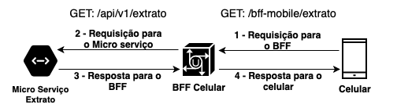

# Jornada Colaborativa - BFF
## Exemplo de microsservicos com BFF (Backend For Frontend)
 - Autor: Jonas Santos

## Pré-requisitos
- Java 13
- Maven
- Docker

## Start containers
```
./docker-run.sh
```

## Stop containers
```
./docker-stop.sh
```

> OBS.: a aplicacão demora um pouco a subir, verificar no serviço de descobertar http://localhost:8761 se os containers `api-gateway, micro-servico-extrato e bff-mobile` estão rodando.

# Detalhes dos containers

| Container           | Descrição                                  | Nome                 | Host
| --------------------|-------------------------------------------|----------------------|------------------------------------
| Discovery           | Descoberta dos microserviços              |service-discovery     |http://localhost:8761
| API Gateway         | Gateway dos microserviços                 |service-gateway       |http://localhost:8762/swagger-ui.html
| Extrato             | Microsserviço de extratos                 |micro-servico-extrato |http://localhost:7001
| BFF Mobile          | Backend For Frontend - Mobile             |bff-mobile            |http://localhost:8081

# Exemplo da troca de informações

